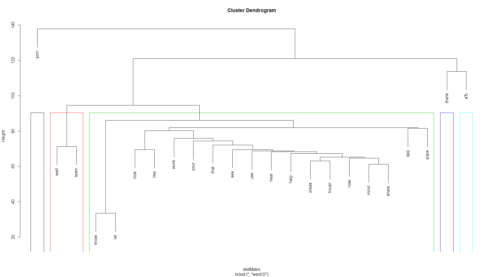
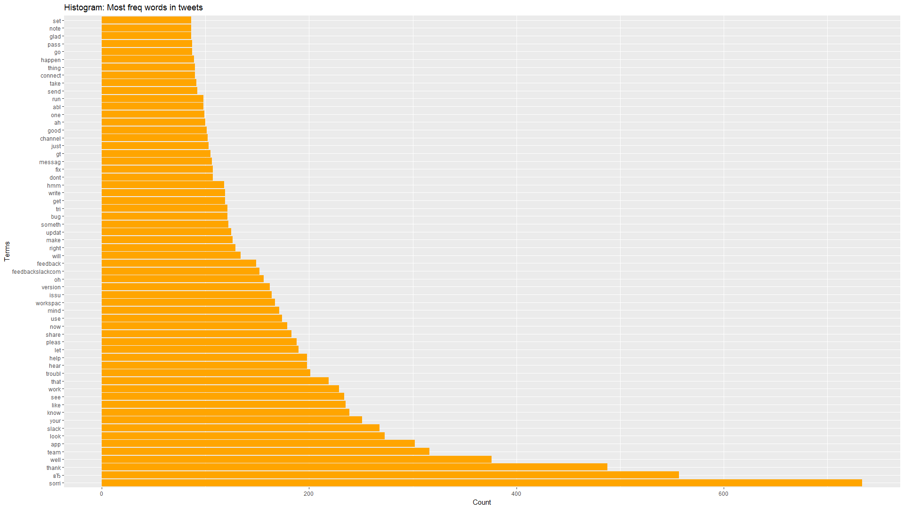
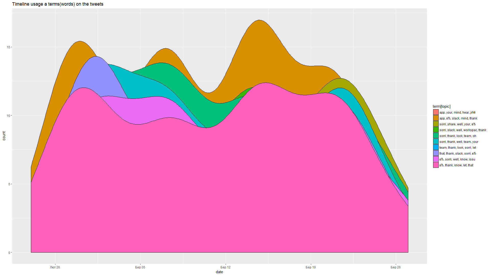
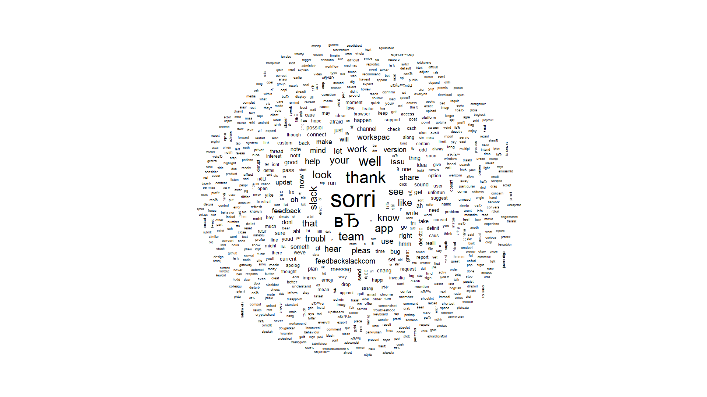

# Tweets Data Analytics

Twitter data analysis in R language. 

Include:
- Data Scraping from Tweeter with twitteR lib;
- Text Cleaning;
- Freq&Assoc Analise;
- Word cloud;
- Clustering;
- Topic model.

Before use don't forget change credetails data in `constants` section to u own.

## Example of usage

## License

The code is available under the [MIT license](LICENSE).
